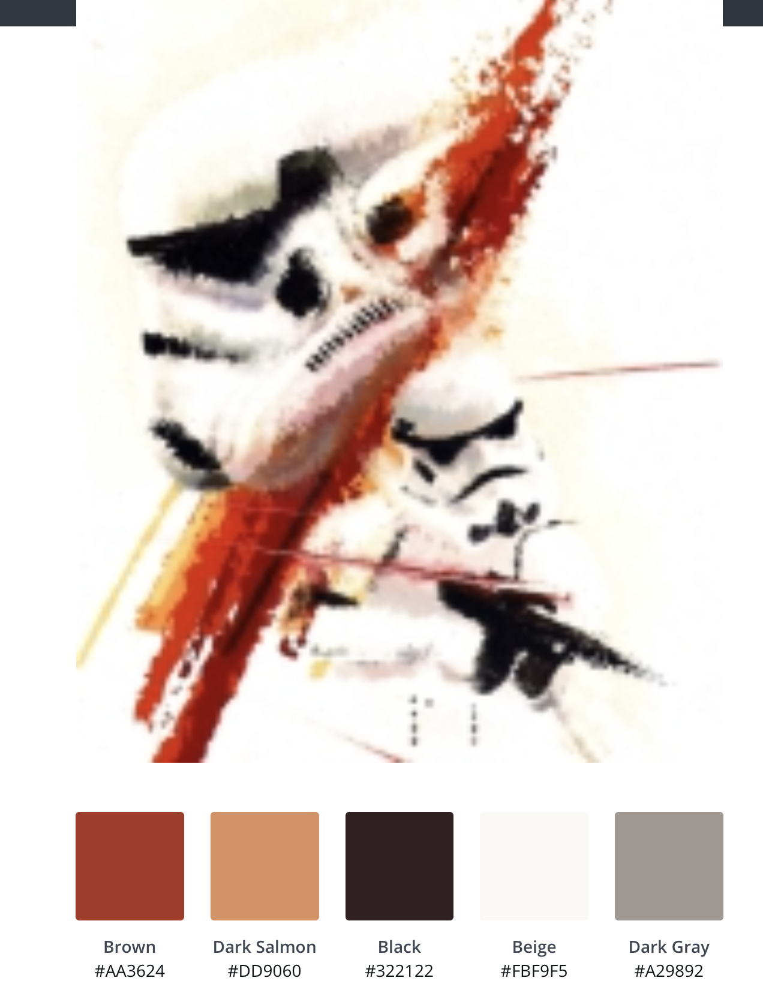

# Milestone Project 1
# Website for actor Anthony Forrest
This concept is being hosted on github, please use the following link to access the website: [Actor Anthony Forrest](https://asforrest.github.io/milestone-1-anthonyforrest/)

This README.me was adapted from the example provided by The Code Institute.

### Copyright Info with relation to Star Wars and Lucasfilm
The print's that Anthony sells with his autograph are official prints that have been created during and for different conventions. Anthony, and this project, make no claim to own Star Wars or any of the copyrights or trademarks related to it. Images used throughout this project are copyrighted to Lucasfilm Limited or another partner of Lucas Licensing, or to the creator of the image. All images are used under 'Fair Use' policy and are of scans physical products that are available for purchase.

## User Experiece

### Site Owner's Goal
I got in contact with Anthony Forrest who wanted a new modern and cleanly designed website to promote himself and also be able to sell different Star Wars merchandise with his autography on it. Anthony was a character in the orginail Star Wars film from 1976 and played 2 different roles. The first was The Fixer which is a friend of the main protagonist, Luke Skywalker, but this was cut from the film before release. The second is a the roll of an iconic Storm Trooper. These characters are important to Star Wars fans and fans pay anywhere between $30 - $60 USD for an autograph.

### External User's Goals (User Stories)

- #### First Time Vistor goals:
    1. Trigger impulse purchase
    2. Provide information about Anthony Forrest
    3. Provide a schedule
    4. Provide contact and booking information

- #### Returning Visitor goals:
    1. Make purchase
    2. Provide a schedule

### Features
- #### Here is a list of features that should be included to satisfy the site owner and external users goals:
    1. A store function so that users can select the products they want autographed and initiate the purchasing process.
    2. A list of upcoming events where fans can arrange meet ups with Anthony Forrest.
    3. A news page to improve Google ranking and provide fans with information about upcoming, ongoing and completed projects.
    4. A contact page where promoters and bookers can get in contact with Anthony Forrest for upcoming events.
    5. A strong 'hero image' at the beginning to create a good impression on visitors to the site.
    6. A trigger at the beginning of the site that redirects users to the store.

- #### Feature Left to Implement
    1. The store function is now very basic and relies on the site owner manually contacting potential customers that place an order. The next evolution of this store could include a link with a payment platform so that orders are processed automatically. An option for this could be a link with PayPal.
    2. Some time of content management system would be preferable for the news section. Providing a form for the site owner to fill in that would automatically update the news site would save time and be less prone to mistakes.
    3. The navbar at the top of the page on the homepage could change color when the user scrolls down to make the text easier to read and avoid the navbar text being projected above other content. This is difficult to impliment due to the need to use JavaScript and is outside the scope of MileStone Project 1.

### Design

- #### color
    - [Canva:](https://www.canva.com/colors/color-palette-generator/) was used to create a color pallete for this website from the logo. And the resulting color palette will be used for this project:
    - Brown #AA3624
    - Dark Salmon #DD9060
    - Black #322122
    - Beige #FBF9F5
    - Dark Grey #A29892

After using the Brown #AA3624 as the main accent color I determined that this was slighty to dark within the design. I therefore used Adobe Photoshop to examine other options for colors within the main logo design and found and strong red that was much more suited to the design. So this color has also been added to the color pallette.
    - Strong Red #C62223

<b>Output from Canva:</b>

- #### Imagery
    - The product, actor Anthony Forrest, needs to be featured prominently on the website

### Wireframes
This is a 3 page website and was first created as a wireframe for mobile, then tablet, then computer (desktop and laptop) and will utilize bootstrap columns to display the information correctly on each page.

- #### Mobile
    - Page 1: [Store](https://github.com/asforrest/milestone-1-anthonyforrest/blob/master/Wireframes%20PNG/Mobile/Mobile%20-%20page%201%20-%20Store.png)
    - Page 2: [News](https://github.com/asforrest/milestone-1-anthonyforrest/blob/master/Wireframes%20PNG/Mobile/Mobile%20-%20page%202%20-%20News.png)
    - Page 3: [Contact](https://github.com/asforrest/milestone-1-anthonyforrest/blob/master/Wireframes%20PNG/Mobile/Mobile%20-%20page%203%20-%20Contact.png)

- #### Tablet
    - Page 1: [Store](https://github.com/asforrest/milestone-1-anthonyforrest/blob/master/Wireframes%20PNG/Tablet/Tablet%20Potrait%20-%20page%201%20-%20Store.png)
    - Page 2: [News](https://github.com/asforrest/milestone-1-anthonyforrest/blob/master/Wireframes%20PNG/Tablet/Tablet%20Potrait%20-%20page%202%20-%20News.png)
    - Page 3: [Contact](https://github.com/asforrest/milestone-1-anthonyforrest/blob/master/Wireframes%20PNG/Tablet/Tablet%20Potrait%20-%20page%203%20-Contact.png)

- #### Computer (desktop and laptop)
    - Page 1: [Store](https://github.com/asforrest/milestone-1-anthonyforrest/blob/master/Wireframes%20PNG/Tablet/Tablet%20Potrait%20-%20page%201%20-%20Store.png)
    - Page 2: [News](https://github.com/asforrest/milestone-1-anthonyforrest/blob/master/Wireframes%20PNG/Tablet/Tablet%20Potrait%20-%20page%202%20-%20News.png)
    - Page 3: [Contact](https://github.com/asforrest/milestone-1-anthonyforrest/blob/master/Wireframes%20PNG/Tablet/Tablet%20Potrait%20-%20page%203%20-Contact.png)

## Techonologies Used

### Languages User
-   [HTML5](https://en.wikipedia.org/wiki/HTML5)
-   [CSS3](https://en.wikipedia.org/wiki/Cascading_Style_Sheets)

### Frameworks, Libraries & Programs Used

1. [Bootstrap 4.4.1:](https://getbootstrap.com/docs/4.4/getting-started/introduction/)
    - Bootstrap was used to assist with the responsiveness and styling of the website.
1. [Google Fonts:](https://fonts.google.com/)
    - Google fonts were used to import the 'Titillium Web' font into the style.css file which is used on all pages throughout the project.
1. [Font Awesome:](https://fontawesome.com/)
    - Font Awesome was used on all pages throughout the website to add icons for aesthetic and UX purposes.
1. [jQuery:](https://jquery.com/)
    - jQuery came with Bootstrap to make the navbar responsive but was also used for the smooth scroll function in JavaScript.
1. [Git](https://git-scm.com/)
    - Git was used for version control by utilizing the Gitpod terminal to commit to Git and Push to GitHub.
1. [GitHub:](https://github.com/)
    - GitHub is used to store the projects code after being pushed from Git.
1. [Photoshop:](https://www.adobe.com/ie/products/photoshop.html)
    - Photoshop was used to create the logo, resizing images and editing photos for the website.
1. [Balsamiq:](https://balsamiq.com/)
    - Balsamiq was used to create the [wireframes](https://github.com/) during the design process.
1. [Canva:](https://www.canva.com/colors/color-palette-generator/)
    - Canva was used to extract a color palette from the logo.

## Gitpod Reminders

To run a frontend (HTML, CSS, Javascript only) application in Gitpod, in the terminal, type:

`python3 -m http.server`
