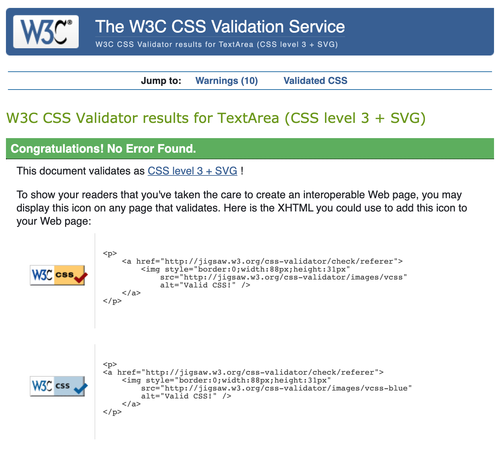

# Milestone Project 1
# Website for actor Anthony Forrest
This concept is being hosted on github, please use the following link to access the website: [Actor Anthony Forrest](https://asforrest.github.io/milestone-1-anthonyforrest/)

This README.me was adapted from the example provided by The Code Institute.

### Copyright Info with relation to Star Wars and Lucasfilm
The folowing disclaimer has been copied from [Wookieepedia](https://starwars.fandom.com/wiki/Wookieepedia:Copyrights)

The print's that Anthony sells with his autograph are official prints that have been created during and for different conventions. Anthony, and this project, make no claim to own Star Wars or any of the copyrights or trademarks related to it. Images used throughout this project are copyrighted to Lucasfilm Limited or another partner of Lucas Licensing, or to the creator of the image. All images are used under 'Fair Use' policy and are of scans physical products that are available for purchase.

## User Experiece

### Site Owner's Goal
I got in contact with Anthony Forrest who wanted a new modern and cleanly designed website to promote himself and also be able to sell different Star Wars merchandise with his autography on it. Anthony was a character in the orginail Star Wars film from 1976 and played 2 different roles. The first was The Fixer which is a friend of the main protagonist, Luke Skywalker, but this was cut from the film before release. The second is a the roll of an iconic Storm Trooper. These characters are important to Star Wars fans and fans pay anywhere between $30 - $60 USD for an autograph.

### External User's Goals (User Stories)

- #### First Time Vistor goals:
    1. Trigger impulse purchase
    2. Provide information about Anthony Forrest
    3. Provide a schedule
    4. Provide contact and booking information

- #### Returning Visitor goals:
    1. Make purchase
    2. Provide a schedule

### Features
- #### Here is a list of features that should be included to satisfy the site owner and external users goals:
    1. A store function so that users can select the products they want autographed and initiate the purchasing process.
    2. A list of upcoming events where fans can arrange meet ups with Anthony Forrest.
    3. A news page to improve Google ranking and provide fans with information about upcoming, ongoing and completed projects.
    4. A contact page where promoters and bookers can get in contact with Anthony Forrest for upcoming events.
    5. A strong 'hero image' at the beginning to create a good impression on visitors to the site.
    6. A trigger at the beginning of the site that redirects users to the store.

- #### Feature Left to Implement
    1. The store function is now very basic and relies on the site owner manually contacting potential customers that place an order. The next evolution of this store could include a link with a payment platform so that orders are processed automatically. An option for this could be a link with PayPal.
    2. Some time of content management system would be preferable for the news section. Providing a form for the site owner to fill in that would automatically update the news site would save time and be less prone to mistakes.
    3. The navbar at the top of the page on the homepage could change color when the user scrolls down to make the text easier to read and avoid the navbar text being projected above other content. This is difficult to impliment due to the need to use JavaScript and is outside the scope of MileStone Project 1.

### Design

- #### color
    - [Canva:](https://www.canva.com/colors/color-palette-generator/) was used to create a color pallete for this website from the logo. And the resulting color palette will be used for this project:
    - Brown #AA3624
    - Dark Salmon #DD9060
    - Black #322122
    - Beige #FBF9F5
    - Dark Grey #A29892

After using the Brown #AA3624 as the main accent color I determined that this was slighty to dark within the design. I therefore used Adobe Photoshop to examine other options for colors within the main logo design and found and strong red that was much more suited to the design. So this color has also been added to the color pallette.
    - Strong Red #C62223

<b>Output from Canva:</b>

- #### Imagery
    - The product, actor Anthony Forrest, needs to be featured prominently on the website

### Pages
The scope of this milestone project is to create a 3-page website. This was an interesting challenge because it requried me to really think about each page and the content to be shown. The page structure needed to fulfill the features of this project are:
1. Home Page / Store
2. News
3. Contact

#### Home Page / Store
The top of the homepage is the first thing that a user will see when visiting the site. For this reason it's important to communicate a few aspects like: Who is the site for?; What is the site about?.

This is achieved by placing Anthony Forrest together with the character Luke Skywalker. This brings legitimacy to him having been in the Star Wars film as well as by pegging the photo to the top right when moving between screen resolutions or to a mobile device Anthony Forrest remains the central focus.

It was also important to communicate that people could buy products from the site and by providing a call to action link that takes people directly to the store this is achieved.

Having the store on the homepage as opposed to a different page was done to lower any barriers for potential customers to make a purchase. By not placing the store on a seperate page people have to click less in order to purchase a product. Sales is also the main focus of the site and therefore it's improtant to give it a prominent position.

It is also important to explain who Anthony Forrest is and what he has done on this page for users who have not earlier heard about Anthony Forrest or the roll he played in Star Wars. This is achieved in the About Anthony section.

Giving users the ability to see when and where they can meet Anthony is also important here so that users don't need to search for this information deeper in the website structure.

#### News Page
This page is meant to convey upcoming, ongoing and completed projects. This page also helps with Google rankings by facilitating link-building and content. Here fans can also read up-to-date information about Anthony Forrest.

#### Contact Page
This page is meant for fans or promotors to get in contact with Anthony. Fans can ask questions and promotors make requests for Anthony to visit their convention. It is important to repeat the Upcoming Events section here so that promoters can see Anthony's current schedule and planning. 

### Wireframes
This is a 3 page website and was first created as a wireframe for mobile, then tablet, then computer (desktop and laptop) and will utilize bootstrap columns to display the information correctly on each page.

- #### Mobile
    - Page 1: [Store](https://github.com/asforrest/milestone-1-anthonyforrest/blob/master/Wireframes%20PNG/Mobile/Mobile%20-%20page%201%20-%20Store.png)
    - Page 2: [News](https://github.com/asforrest/milestone-1-anthonyforrest/blob/master/Wireframes%20PNG/Mobile/Mobile%20-%20page%202%20-%20News.png)
    - Page 3: [Contact](https://github.com/asforrest/milestone-1-anthonyforrest/blob/master/Wireframes%20PNG/Mobile/Mobile%20-%20page%203%20-%20Contact.png)

- #### Tablet
    - Page 1: [Store](https://github.com/asforrest/milestone-1-anthonyforrest/blob/master/Wireframes%20PNG/Tablet/Tablet%20Potrait%20-%20page%201%20-%20Store.png)
    - Page 2: [News](https://github.com/asforrest/milestone-1-anthonyforrest/blob/master/Wireframes%20PNG/Tablet/Tablet%20Potrait%20-%20page%202%20-%20News.png)
    - Page 3: [Contact](https://github.com/asforrest/milestone-1-anthonyforrest/blob/master/Wireframes%20PNG/Tablet/Tablet%20Potrait%20-%20page%203%20-Contact.png)

- #### Computer (desktop and laptop)
    - Page 1: [Store](https://github.com/asforrest/milestone-1-anthonyforrest/blob/master/Wireframes%20PNG/Tablet/Tablet%20Potrait%20-%20page%201%20-%20Store.png)
    - Page 2: [News](https://github.com/asforrest/milestone-1-anthonyforrest/blob/master/Wireframes%20PNG/Tablet/Tablet%20Potrait%20-%20page%202%20-%20News.png)
    - Page 3: [Contact](https://github.com/asforrest/milestone-1-anthonyforrest/blob/master/Wireframes%20PNG/Tablet/Tablet%20Potrait%20-%20page%203%20-Contact.png)

## Techonologies Used

### Languages User
-   [HTML5](https://en.wikipedia.org/wiki/HTML5)
-   [CSS3](https://en.wikipedia.org/wiki/Cascading_Style_Sheets)

### Frameworks, Libraries & Programs Used

1. [Bootstrap 4.4.1:](https://getbootstrap.com/docs/4.4/getting-started/introduction/)
    - Bootstrap was used to assist with the responsiveness and styling of the website.
1. [Google Fonts:](https://fonts.google.com/)
    - Google fonts were used to import the 'Titillium Web' font into the style.css file which is used on all pages throughout the project.
1. [Font Awesome:](https://fontawesome.com/)
    - Font Awesome was used on all pages throughout the website to add icons for aesthetic and UX purposes.
1. [jQuery:](https://jquery.com/)
    - jQuery came with Bootstrap to make the modals work properly.
1. [Git](https://git-scm.com/)
    - Git was used for version control by utilizing the Gitpod terminal to commit to Git and Push to GitHub.
1. [GitHub:](https://github.com/)
    - GitHub is used to store the projects code after being pushed from Git.
1. [Photoshop:](https://www.adobe.com/ie/products/photoshop.html)
    - Photoshop was used to create the logo, resizing images and editing photos for the website.
1. [Balsamiq:](https://balsamiq.com/)
    - Balsamiq was used to create the [wireframes](https://github.com/) during the design process.
1. [Canva:](https://www.canva.com/colors/color-palette-generator/)
    - Canva was used to extract a color palette from the logo.

## Testing
### Methodology
During the building process in GitPod a local server was used to see the effect of changes on a live version of the website. After every change the effects were monitored on the local live version. All the links have been clicked and checked at different screen resolutions to make sure that all the links are referencing the correct pages, sections or components.

Experimentation with different snippets of code they were controlled on multiple points:
1. Desktop computer in Google Chrome and Safari
1. Laptop computer in Google Chrome and Safari
1. Mobile view via Inspect options on Google Chrome
1. Responsiveness of the site while moving through different screen resolutions from a width of 300px -> 1400px

### HTML Validation
The HTML code has been checked using [validator.w3.org](https://validator.w3.org/nu/?doc=https%3A%2F%2Fasforrest.github.io%2Fmilestone-1-anthonyforrest%2F)

- #### There were 14 errors found:
    - [See test results](https://asforrest.github.io/milestone-1-anthonyforrest/W3-Nu-Html-Checker-test-results.pdf)
    - 12 errors are related to incorrect use of "aria-labelledby" being used incorrectly because they don't point to attributes in the same document. The solution was to remove these labels as they are not required for the purposes of this site.
    - 2 errors are related to spaces being used between the &nbsp (space in HTML) and text. The solution was to remove this space.

After making these changes, the HTML code came back as having no errors:

### CSS Validation
The CSS code has been checked using jigsaw.w3.org's [CSS Validator](https://jigsaw.w3.org/css-validator/validator)

The CSS code came back as having no errors:

### Contact with Mentor
My mentor Jonathan Munz was impressed by the way the site looks and feels and has given great feedback about points to address.

## Deployment
This project is hosted on a GitHub repository and has been deployed using GitHub pages.

This project has 50+ commits where notes have been made as to what changes are made, what resources were used and which bugs were solved. These commits can also be used to take a look at the development process throughout all the steps in the process: [GitHub Commits](https://github.com/asforrest/milestone-1-anthonyforrest)
During testing the code was hosted locally within Gitpod by hosting a server with the teminal command "python3 -m http.server" which allowed me to open the project and view any changes before commiting to GitHub.

## Credits

The bulk of this project has been constructed from code that has been written while using The Code Institute's lessons. The primary resource has been the lessons on using Bootstrap and the mini resume project. Certain elements have been copied from these lessons and modified. These copied sections have been noted in the source code with comments above the snippet that has been copied and used.

[Bootstrap Component Documentation](https://getbootstrap.com/docs/4.5/components/alerts/) was also referenced and used as a basis to make certain components, like the embedded media player, work.

## Media
Anthony Forrest, the subject for this project, already has a website with products on it: http://anthonyforrest-starwars.com/ and I have been given permission from him to use the images. High resolution images, like the logo on the contact page, were provided to me via email.

Other resources for media include the embedded YouTube video on the homepage from YouTube Channel: [Build Series](https://www.youtube.com/channel/UClZmCCcrhNaXhWYvZNIolWg)

Images used in the news items section are screenshots from those videos and also link to the videos they are a screenshot of. These screenshots and YouTube links belong to the channels: [CBS This Morning](https://www.youtube.com/channel/UC-SJ6nODDmufqBzPBwCvYvQ), [AOL Build Series](https://www.youtube.com/channel/UClZmCCcrhNaXhWYvZNIolWg), [It's Erik Nagel](https://www.youtube.com/channel/UCZsglkJyW0T00g01FXmxRNQ), and [Cast Sutra](https://www.youtube.com/channel/UCGme36OHxUXi0XdAJFYRFUA).

## Acknowledgements

I received inspiration from Anthony Forrest's current website for the color palette and information to be included.

For the store section I looked at the app Zalando Lounge to see how an effective store lines out it's content.

My mentor Jonathan Munz has been essential in confirming my direction and giving input as to elements which would be found on the site. Orignally I had 2 different projects in mind, the first was a website to promote myself as a videographer and the second was the site for my father Anthony Forrest because he was looking for an updated design for his website. During my discussion's with Jonathan we decided that using my father as the subject for this project would be a better fit due to content being available (from him and from his current website) and also because the subject matter is interesting.
